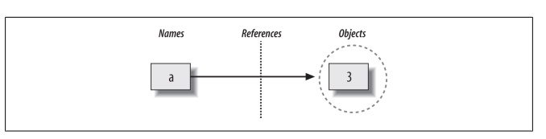
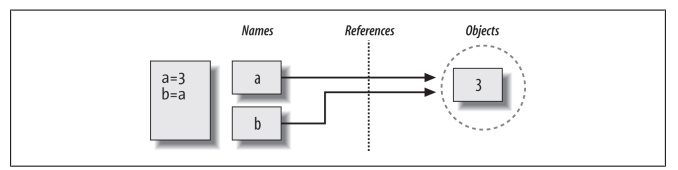
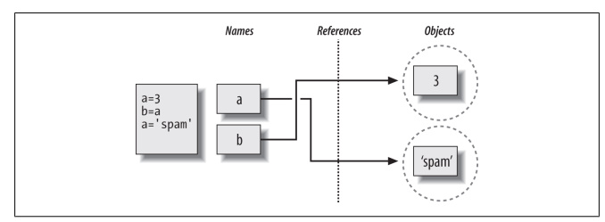

## 1.1 Dynamic Typing là gì?

Python cho phép chúng ta không khai báo loại (type) đối tượng mà tập lệnh (script) của chúng ta sử dụng. Trên thực tế, hầu hết các chương trình thậm chí không nên quan tâm đến các loại cụ thể, vì thế chúng ta có thể áp dụng linh hoạt (flexibility) trong nhiều ngữ cảnh.

Ví dụ: khi chúng ta nhập a = 3 vào một phiên(session) hoặc tệp chương trình (file program) làm thế nào Python biết rằng a phải là đại diện cho một số nguyên? Đối với vấn đề đó, Python biết a là gì?

Khi bạn bắt đầu đặt những câu hỏi như vậy, bạn đã chuyển sang lĩnh vực của Python
kiểu gõ động. Trong Python, các loại được xác định tự động trong thời gian chạy (automatically at runtime), không phải để phản hồi các khai báo trong mã của bạn (declarations in your code). Điều này có nghĩa là bạn không bao giờ khai báo các biến trước thời hạn (declare variables
ahead of time).

Một khái niệm có lẽ dễ nắm bắt hơn nếu bạn ghi nhớ rằng tất cả tóm tắt các biến, đối tượng và liên kết giữa chúng.

# 1.2 Biến(Variables), đối tượng(Objects) và tham khảo(References)
Ngôn ngữ Python, tất cả điều này diễn ra theo một cách rất tự nhiên, như sau:

**Tạo biến (Variable creation)**

Một biến (tức là tên), như a, được tạo khi mã của bạn gán giá trị cho nó lần đầu tiên.
Các nhiệm vụ trong tương lai thay đổi giá trị của tên đã được tạo. Về mặt kỹ thuật,
Python phát hiện một số tên trước khi mã của bạn chạy, nhưng bạn có thể nghĩ về nó như thể
các phép gán ban đầu tạo ra các biến.

**Kiểu của biến(Variable types)**

Một biến không bao giờ có bất kỳ thông tin kiểu hoặc ràng buộc(constraints) nào được liên kết với nó. Các biến có bản chất chung; chúng luôn luôn chỉ tham chiếu (refer đến một đối tượng cụ thể(particular object) tại một thời điểm cụ thể(particular point).

**Sử dụng biến đổi(Variable use)**

Khi một biến xuất hiện trong một biểu thức(expression), nó ngay lập tức được thay thế bằng đối tượng mà nó hiện đang đề cập đến.

**Tóm lại** các biến được tạo khi được gán (assigned), có thể tham chiếu đến bất kỳ loại đối tượng nào và phải được chỉ định trước. Do đó có nghĩa là bạn không bao giờ cần khai báo tên
được sử dụng trong chương trình của bạn, nhưng bạn phải khởi tạo tên trước khi có thể cập nhật chúng.
```python
a=3
```
Các bước trong ngôn ngữ Python
1. Tạo một đối tượng để biểu diễn giá trị 3.
2. Tạo biến a, nếu nó chưa tồn tại.
3. Liên kết biến a với đối tượng mới 3.



Các liên kết từ names đến object có thể gọi là tham chiếu (References) và nó thực hiện như một con trỏ (pointer) trong bộ nhớ.

Bất cứ khi nào các biến sau đó được sử dụng, Python tự động chuyển biến thành đối tượng
bởi các liên kết. Nói một cách cụ thể:

+ Biến là các lối vào (entry) trong bảng hệ thống, có khoảng trắng(spaces) cho các liên kết (links) đến các đối tượng.
+ Đối tượng là các phần của bộ nhớ được cấp phát (allocated memory), có đủ không gian để biểu diễn các giá trị.
+ Tham chiếu là các con trỏ tự động (automatically pointers)  theo sau từ các biến đến các đối tượng.


Về mặt kỹ thuật, các đối tượng có nhiều cấu trúc hơn là chỉ đủ không gian để biểu diễn giá trị của chúng. Mỗi đối tượng cũng có hai trường tiêu đề tiêu chuẩn: một bộ chỉ định loại được sử dụng để
đánh dấu loại đối tượng(mark type of object) và bộ đếm tham chiếu (reference counter) được sử dụng để xác định thời điểm có thể đòi lại đối tượng.
```python
a=3
a='spam'
a=1.23
a
```
Trong python tên name không có kiểu, các kiểu live với object không phải tên.

Ta thấy a từ kiểu interger chuyển sang kiểu string tiếp đến chuyển đến kiểu float bằng cách dùng thay đổi tham chiếu liên kết giữa name và object khác nhau.

Bởi vì các biến không có kiểu, chúng ta sẽ trực tiếp thay đổi kiểu của biến a; chúng ta chỉ đơn giản là làm tham chiếu biến một loại đối tượng khác.

Các đối tượng tự biết kiểu của chúng sau đó vì vậy và một biến nhất định thường sẽ chỉ tham chiếu đến một loại đối tượng cuối cùng như ví dụ trên thì biến a sẽ lấy kiểu là kiểu float.

Để hiểu phần sau của những điều này, chúng ta cần tiếp tục và xem xét sơ lược ở những gì xảy ra vào cuối vòng đời của một đối tượng.
## 1.3 Objects Are Garbage-Collected
```python
a=3
a='spam'
```
Bất cứ khi nào tên được gán cho một đối tượng mới, không gian được giữ bởi đối tượng trước đó sẽ được lấy lại nếu nó không được tham chiếu bởi bất kỳ tên hoặc đối tượng nào khác.

Việc cải tạo tự động không gian của các đối tượng này được gọi là thu gom rác và làm cho
cuộc sống đơn giản hơn nhiều đối với các lập trình viên của các ngôn ngữ như Python hỗ trợ nó.
```python
x=42
x ='shrubbery'
x = 3.1415
x = [1, 2, 3]
```
Ví dụ, khi nó được gán cho chuỗi 'shrubbery', đối tượng 42 ngay lập tức được thu hồi (giả sử
nó không được tham chiếu ở bất kỳ nơi nào khác) — nghĩa là, không gian của đối tượng được tự động ném trở lại nhóm không gian trống, để được tái sử dụng cho một đối tượng trong tương lai.

Bên trong, Python đạt được kỳ tích này bằng cách giữ một bộ đếm trong mọi đối tượng giữ theo dõi số lượng tham chiếu hiện đang trỏ đến đối tượng đó. Ngay sau khi (và chính xác khi nào) bộ đếm này giảm xuống 0, không gian bộ nhớ của đối tượng sẽ tự động giải phóng. Trong ví dụ trước, chúng tôi giả định rằng mỗi lần x được chỉ định cho một đối tượng, bộ đếm tham chiếu của đối tượng trước đó giảm xuống 0, khiến nó được lấy lại. Lợi ích hữu hình ngay lập tức của việc thu gom rác là nó có nghĩa là bạn có thể sử dụng các đối tượng một cách tự do mà không cần phải phân bổ hoặc giải phóng dung lượng trong tập lệnh của bạn.

Python sẽ dọn dẹp không gian không sử dụng cho bạn khi chương trình của bạn chạy. Trong thực tế, điều này loại bỏ một lượng đáng kể mã kế toán(keepbooking) bắt buộc bằng các ngôn ngữ cấp thấp hơn
chẳng hạn như C và C ++.

# 1.4 Chia sẻ Reference
Hãy xem ví dụ sau đây:
```python
a=3
b=a
b
```
`Output: 3`



Bạn nghĩ biến a sẽ được liên kết với biến b bằng lệnh gán nếu nghĩ vậy thì chúc mừng bạn đã suy nghĩ sai, mà biến b sẽ được tham chiếu tới cùng object của biến a đó là số 3.

Trường hợp này trong Python với nhiều tên tham chiếu đến cùng một đối tượng thường là
được gọi là một tham chiếu được chia sẻ (và đôi khi chỉ là một đối tượng được chia sẻ). Lưu ý rằng các tên a và b không liên kết trực tiếp với nhau khi điều này xảy ra; trên thực tế, không có cách nào để liên kết một biến với một biến khác trong Python. Thay vào đó, cả hai biến đều trỏ đến
cùng một đối tượng thông qua các tham chiếu của họ.
```python
a=3
b=a
a='spam'
b
```
`Output: 3 `



Câu lệnh này chỉ đơn giản là tạo một đối tượng mới để đại diện giá trị chuỗi 'spam' và đặt a để tham chiếu đến đối tượng mới này. Tuy nhiên, nó không thay đổi giá trị của b; b vẫn tham chiếu đến đối tượng ban đầu, số nguyên 3.

# 1.5 In-Place Changes
Có các đối tượng và hoạt động thực hiện thay đổi đối tượng tại chỗ — Các loại có thể thay đổi của Python, bao gồm danh sách, từ điển và bộ.

Đối với các đối tượng hỗ trợ các thay đổi tại chỗ như vậy, bạn cần nhận thức rõ hơn về các tham chiếu được chia sẻ, vì sự thay đổi từ một tên có thể tác động đến object. 
Cho rằng tất cả các phép gán đều dựa trên tham chiếu (bao gồm cả việc truyền đối số hàm), đó là một tiềm năng phổ biến.

L1 đây là danh sách chứa các đối tượng 2, 3 và 4. Các mục bên trong danh sách được truy cập bởi
vị trí, vì vậy L1 [0] tham chiếu đến đối tượng 2, mục đầu tiên trong danh sách L1. Sau khi chạy hai trước phép gán, L1 và L2 tham chiếu đến cùng một đối tượng được chia sẻ, giống như a và b trong phần trước.
```python
L1=[2,3,4]
L2=L1
L1=24
```
```python
print(L2,L1,sep=',')
```
`Output: [2, 3, 4],24`

**Thay đổi code một tý**

```python
L1 = [2, 3, 4] #Object thay đổi được
L2 = L1 
L1[0] = 24
```
```python
print(L1,L2,sep=',')
```
`Output: [24, 3, 4],[24, 3, 4]`

Thực sự, chúng tôi đã không thay đổi chính L1 ở đây; chúng tôi đã thay đổi một thành phần của đối tượng mà tham chiếu L1. Loại thay đổi này ghi đè một phần giá trị của đối tượng danh sách tại chỗ.

Tuy nhiên, vì đối tượng danh sách được chia sẻ bởi (được tham chiếu từ) các biến khác, một thay đổi tại chỗ như thế này không chỉ ảnh hưởng đến L1 — nghĩa là, bạn phải lưu ý rằng khi bạn
thực hiện những thay đổi như vậy, chúng có thể ảnh hưởng đến các phần khác trong chương trình của bạn. 
Trong ví dụ này, hiệu ứng cũng hiển thị trong L2 vì nó tham chiếu đến cùng một đối tượng như L1. Một lần nữa, chúng tôi cũng chưa thực sự thay đổi L2, nhưng giá trị của nó sẽ có vẻ khác vì nó đề cập đến vào một đối tượng đã được ghi đè tại chỗ.

Hành vi này chỉ xảy ra đối với các đối tượng có thể thay đổi hỗ trợ các thay đổi tại chỗ và
thường là những gì bạn muốn, nhưng bạn nên biết cách hoạt động của nó, để nó được mong đợi.
Nó cũng chỉ là mặc định: nếu bạn không muốn hành vi như vậy, bạn có thể yêu cầu Python đó
sao chép các đối tượng thay vì tạo tham chiếu.
```python
L1 = [2, 3, 4]
L2 = L1[:] # Tạo một bản sao L1 
L1[0] = 24
```
```python
print(L1,L2,sep=',')
```
`Output: [2, 3, 4],[24, 3, 4]`

# 1.6 Shared References and Equality
Xem ví dụ sau:
```python
L = [1, 2, 3]
M = L # M và L cùng reference tới object
L == M # Giống nhau giá trị 
```
`Output: True`
```python
L is M # Giống nhau object
```
`Output: True`

Kỹ thuật đầu tiên ở đây, toán tử ==, kiểm tra xem hai đối tượng được tham chiếu có
các giá trị giống nhau; đây là phương pháp hầu như luôn được sử dụng để kiểm tra bình đẳng trong Python.

Phương thức thứ hai, toán tử is, thay vào đó kiểm tra nhận dạng đối tượng — nó trả về True
chỉ khi cả hai tên đều trỏ đến cùng một đối tượng, vì vậy nó là một dạng mạnh hơn nhiều
kiểm tra bình đẳng và hiếm khi được áp dụng trong hầu hết các chương trình.

Thực sự, chỉ đơn giản là so sánh các con trỏ triển khai các tham chiếu và nó đóng vai trò là
cách phát hiện các tham chiếu được chia sẻ trong mã của bạn nếu cần. Nó trả về False nếu tên
trỏ tới các đối tượng tương đương nhưng khác nhau.
```python
L = [1, 2, 3]
M = [1, 2, 3] # M và L reference khác objects
L == M
```
`Output: True`
```python
L is M
```
`Output: False`

Trên thực tế, nếu bạn thực sự muốn xem xét kỹ lưỡng, bạn luôn có thể hỏi Python có bao nhiêu
tham chiếu đến một đối tượng: hàm getrefcount trong mô-đun sys tiêu chuẩn
trả về số lượng tham chiếu của đối tượng.
```python
import sys
sys.getrefcount('b') 
```
`Output: 214`

# Kết luận 
Nhập động có vẻ hơi trừu tượng vào thời điểm này, bạn có thể sẽ quan tâm đến nó cuối cùng. Bởi vì mọi thứ dường như hoạt động bằng cách phân công (assignment) và tham chiếu (references) trong Python, hiểu biết cơ bản về mô hình này rất hữu ích trong nhiều ngữ cảnh khác nhau. Như bạn sẽ thấy, nó hoạt động giống nhau trong các câu lệnh gán, đối số (arguments) hàm,cho các biến vòng lặp, nhập mô-đun, thuộc tính lớp và hơn thế nữa. 

Thực tế, nhập động có nghĩa là có ít mã hơn để bạn viết.Tuy nhiên, quan trọng không kém, nhập động cũng là gốc rễ của tính đa hình của Python.
